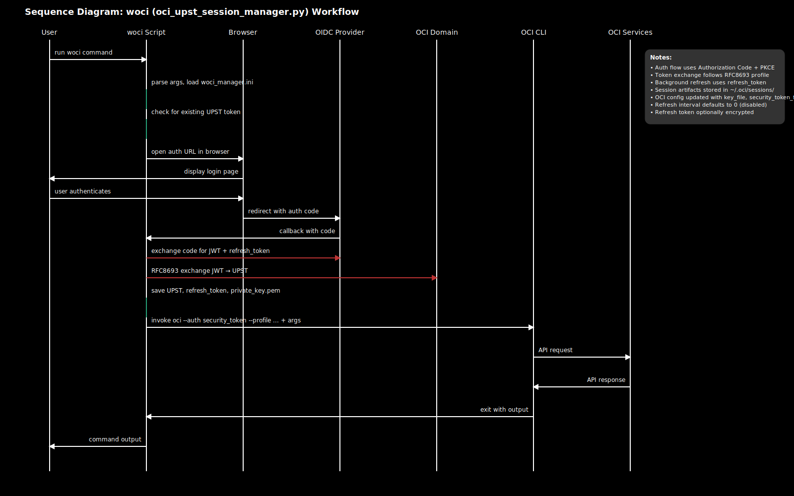

# WOCI Session Manager Quick Start
<!-- License: MIT (see LICENSE file). Copyright (c) 2025 Gordon Trevorrow -->

Wraps the OCI CLI to transparently obtain and refresh a security token (UPST) via:
1. OAuth 2.0 Authorization Code + PKCE (interactive, first use)
2. Refresh Token grant (silent renew of access token)
3. OCI Workload Identity Federation token exchange (RFC 8693 profile with OCI-specific extensions)

Note: The token exchange follows RFC 8693 semantics with OCI extensions (e.g., requested_token_type=urn:oci:token-type:oci-upst, a required public_key parameter, and a response field named token).

## Sequence Diagram



## Prerequisites

Before installing the wrapper, ensure you have:

### OCI Workload Identity Federation Configuration
- **Trust relationship configured**: OCI Workload Identity Federation must be set up to establish trust between your OAuth/OIDC authorization server (e.g., Okta) and an OCI IAM domain.
- **User exists in the domain**: Your user account must exist in the OCI IAM domain that trusts the authorization server.
- **OAuth client registered**: An OAuth 2.0 client (confidential client with client_id and client_secret) must be registered in your authorization server with:
  - Authorization Code grant type enabled
  - Refresh Token grant type enabled (offline_access scope)
  - Redirect URI `http://127.0.0.1:8181/callback` (or your chosen port) registered

See [OCI Workload Identity Federation documentation](https://docs.oracle.com/en-us/iaas/Content/Identity/federation/workload-identity-federation.htm) for detailed setup steps.

### Runtime Requirements
- Python 3.9+ (Options 1 and 2). Option 3 creates its own virtualenv.
- OCI CLI installed and on PATH (`oci` command available)

## Get the code (Bitbucket)
Choose one of the following ways to fetch the sources from the Bitbucket repo:

- Git clone (recommended; gets the branch):
```bash
git clone https://bitbucket.org/gordontrevorrow/token-exchange.git
cd token-exchange
# checkout the feature branch
git checkout feature/woci-session-manager
```

- Download the branch as a ZIP (no git required):
```bash
curl -L -o woci.zip \
  "https://bitbucket.org/gordontrevorrow/token-exchange/get/feature/woci-session-manager.zip"
unzip woci.zip
cd gordontrevorrow-token-exchange-*
```

- Download a specific commit (locked snapshot):
```bash
# commit: 08ed2b830551ba34cfdff700f712934e2293dbda
curl -L -o woci-commit.zip \
  "https://bitbucket.org/gordontrevorrow/token-exchange/get/08ed2b830551ba34cfdff700f712934e2293dbda.zip"
unzip woci-commit.zip
cd gordontrevorrow-token-exchange-*
```

Expected files (minimal checklist):
- `oci_upst_session_manager.py` (main tool)
- `oci_session_wrapper.py` (CLI wrapper for oci session authenticate/refresh)
- `requirements.txt` (deps)
- `install.sh` (Option 3 installer)
- `woci-manager.ini` (sample manager config)
- `pyproject.toml` (Option 4 pipx install)
- `QUICKSTART.md`, `LICENSE`

## Install

Prerequisites:
- Python 3.9+ (Options 1 and 2). Option 3 creates its own virtualenv.
- OCI CLI installed (`oci` on PATH)

### Option 1: Symlink directly to the script (simple, uses system Python)
Install Python dependencies into the interpreter that will run the script:
```bash
python3 -m pip install --user -r requirements.txt
```
Then create a convenient shim:
```bash
chmod +x oci_upst_session_manager.py
ln -sf "$(pwd)/oci_upst_session_manager.py" /usr/local/bin/woci
which woci
woci --help
```

### Option 2: Manual virtualenv (you manage the venv)
```bash
python3 -m venv .woci-venv
source .woci-venv/bin/activate
pip install -r requirements.txt
python oci_upst_session_manager.py --help
# Optional global shim
ln -sf "$(pwd)/oci_upst_session_manager.py" /usr/local/bin/woci
```
Deactivate later with `deactivate`.

### Option 3: Self-contained installer script (recommended)
Creates an isolated virtualenv under `~/.local/share/oci-upst-manager` and a launcher in `~/.local/bin`.
```bash
chmod +x install.sh
./install.sh
~/.local/bin/oci-upst-session-manager --help
```
Optional convenience alias "woci":
```bash
ln -sf "$HOME/.local/bin/oci-upst-session-manager" "$HOME/.local/bin/woci"
which woci
```
If `~/.local/bin` is not on your PATH (bash):
```bash
echo 'export PATH="$HOME/.local/bin:$PATH"' >> ~/.bash_profile
source ~/.bash_profile
```
Notes:
- Option 3 installs dependencies automatically from `requirements.txt` (no manual `pip install` needed).
- The launcher name is `oci-upst-session-manager`; adding the `woci` alias keeps examples below consistent.

### Option 4: pipx (isolated venv with global CLI)
Install as an isolated app without managing virtualenvs yourself:
```bash
# install pipx if needed (macOS/Homebrew example)
brew install pipx || python3 -m pip install --user pipx
python3 -m pipx ensurepath

# from the repository root
pipx install . --python python3
woci --help
```
Upgrade or reinstall from local sources:
```bash
pipx uninstall woci-session-manager || true
pipx install . --python python3
```
Uninstall:
```bash
pipx uninstall woci-session-manager
```
Notes:
- This uses the console script entrypoint `woci` (also `woci-session-manager`) defined in `pyproject.toml`.
- Dependencies are pinned by `requirements.txt` equivalents in `pyproject.toml` (requests, cryptography).

## Configuration Files

OCI CLI config (standard): `~/.oci/config`

WOCI manager config (auto-discovered): `~/.oci/woci_manager.ini` OR same directory as any `--config-file` you pass.

Default auto-discovery filename: `woci_manager.ini`.

Auto-discovery rules:
1. Wrapper reads `--config-file` (or defaults to `~/.oci/config`).
2. Looks for `woci_manager.ini` in the same directory.
3. If not found there, looks for `~/.oci/woci_manager.ini`.
4. Explicit `--manager-config` overrides auto-discovery entirely.

The manager INI supports a real `[COMMON]` section for shared values across profiles (e.g., `redirect_port`, `log_level`).
CLI flags always override values from the selected section; `[COMMON]` fills in any missing keys for that section.
If no profile section is selected or provided, a section literally named `[DEFAULT]` is used as the effective profile name (mirroring OCI behavior).

Section name chosen using precedence documented in Profile Resolution Semantics. CLI flags override section values; manager config never overrides an explicitly supplied CLI flag.

Sample `woci_manager.ini`:
```ini
[COMMON]
redirect_port = 8181
log_level = INFO

[myprofile]
authz_base_url = https://idcs-tenant.identity.oraclecloud.com/oauth2/v1/authorize
token_url = https://idcs-tenant.identity.oraclecloud.com/oauth2/v1/token
client_id = YOUR_CLIENT_ID
client_secret = YOUR_CLIENT_SECRET
scope = openid offline_access
```

Token exchange endpoint guidance:
- If the same token endpoint supports RFC 8693 token exchange, omit `token_exchange_url`.
- If OCI IAM uses a distinct host/endpoint for exchange, set `token_exchange_url` explicitly.

## Profile Resolution Semantics
Effective profile name (used for OCI profile and session artifact paths) is chosen by precedence:
1. `--profile-name` (wrapper flag)
2. Passthrough `--profile` (OCI CLI flag in the remaining args)
3. Selected manager config section name (see below)
   - Section resolution order: explicit `--manager-config-section`, section matching `--profile-name`, section matching passthrough `--profile`, section named `DEFAULT` (mirrors OCI), otherwise first real section.
4. Failure: exit with error if no profile determined.

Artifacts stored under: `~/.oci/sessions/<profile>/`:
- `token` (UPST)
- `private_key.pem`
- `refresh_token` (optionally encrypted)

OCI config is updated (created if absent) with:
- `key_file`
- `security_token_file`
- `region` (if provided)

Additional notes:
- DEFAULT pseudo-section contributes values only; it is not used as a profile name.
- The effective profile determines the folders: `~/.oci/sessions/<profile>/`.

## Redirect URI & Port
Default redirect URI: `http://127.0.0.1:8181/callback`
Change port with `--redirect-port <port>` (must match a registered redirect URI in your OAuth client).
Make sure you register the exact URI (host, port, path) with your authorization server.

## Required Runtime Values
Must be provided via CLI or manager config: `authz_base_url`, `token_url`, `client_id`, `client_secret`, `scope`.
`client_secret` is mandatory for OCI IAM token exchange.
- `scope` must include `offline_access` (or equivalent for your provider) to obtain a refresh token.

## Encryption (Optional)
Provide a passphrase to encrypt the refresh token file:
- `--refresh-token-passphrase-env VAR_NAME` (VAR_NAME must be set in environment)
- `--refresh-token-passphrase-prompt` (interactive prompt)
Algorithm: AES-GCM + PBKDF2 (200k iterations) + random salt/nonce.

Behavior:
- If the stored refresh token file is encrypted and you invoke without a passphrase source, the wrapper errors out and does not proceed.
- Passphrase precedence: prompt (`--refresh-token-passphrase-prompt`) > env (`--refresh-token-passphrase-env`).

## First Run Flow
1. Launch `woci` with an OCI command.
2. If no valid UPST & refresh token: browser opens Authorization Code flow (PKCE).
3. Exchange code -> access + refresh tokens.
4. Exchange access token -> UPST; store artifacts; update OCI config.
5. Forward original OCI command.

Subsequent runs:
- If UPST still valid (>60s remaining) => reuse.
- Else if refresh token exists => refresh + exchange silently.
- Else fallback to interactive flow again.

## Usage Examples

Interactive cluster token generation:
```bash
woci \
  --profile-name myprofile \
  --authz-base-url https://idcs-tenant.identity.oraclecloud.com/oauth2/v1/authorize \
  --token-url https://idcs-tenant.identity.oraclecloud.com/oauth2/v1/token \
  --client-id YOUR_CLIENT_ID \
  --client-secret YOUR_CLIENT_SECRET \
  --scope "openid offline_access" \
  ce cluster generate-token --cluster-id OCID
```
(Region may be inferred from OCI config; add `--region us-ashburn-1` if needed.)

Using manager config only (auto-discovered):
```bash
woci ce cluster generate-token --cluster-id OCID --profile myprofile
```

Encrypt refresh token (env var method):
```bash
export WOCI_RT_PASSPHRASE="StrongPassphrase"
woci --refresh-token-passphrase-env WOCI_RT_PASSPHRASE ... <OCI COMMAND>
```

Add token exchange URL if needed:
```bash
woci --token-exchange-url https://login.us-ashburn-1.oraclecloud.com/oauth2/v1/token ...
```

## Kubeconfig Exec Integration
Example user exec block that references the woci-manager.ini config file and profile to generate a cluster token:
```yaml
-  user:
     exec:
       apiVersion: client.authentication.k8s.io/v1beta1
       args:
         - ce
         - cluster
         - generate-token
         - --cluster-id
         - ocid1.cluster.oc1.iad.aaaaaaaat7zsrk4k2rn5y33v2srajzcbspo2t62jxzi73nkzfcsouxxxxx
         - --region
         - us-ashburn-1
         - --auth
         - security_token
         - --profile
         - myProfile
         - --manager-config
         - /Users/foo/Documents/projects/token-exchange/woci-manager.ini
       command: woci
```
First call triggers interactive login; subsequent calls refresh silently.

## Troubleshooting
- Browser not opening: copy logged Auth URL manually; on macOS the script attempts `open` fallback.
- "Missing required options": ensure values present via CLI or config section.
- "Could not determine profile name": provide `--profile-name` or `--profile` or add a named section.
- Token not refreshing: check presence/permissions of `~/.oci/sessions/<profile>/refresh_token`.
- Encrypted refresh token but no passphrase supplied: provide env var or prompt flag.
- Encrypted refresh token error: supply passphrase again (env or prompt) to unlock.
- Authorization errors: verify redirect URI registration & exact client_id/client_secret.
- Browser fails to open: copy the logged `Auth URL:` manually or run `open <URL>` on macOS.

## Security Notes
- Refresh token is sensitive; prefer encryption at rest.
- Session token lifetime is capped at 60 minutes; the wrapper renews via refresh token before running OCI commands.
- Passphrase derivation uses PBKDF2-HMAC-SHA256 (200k iterations) for a balanced cost.
Additional considerations:
- Avoid committing `woci_manager.ini` if it contains a `client_secret`.
- Tokens are never logged; only the authorization URL is printed.
- Refresh token rotation: Some providers rotate refresh tokens; script saves new one if returned.

## Exit Codes
- 0  Wrapper succeeded and underlying OCI command exited 0
- 2  Argument or configuration error detected by wrapper (missing required values, invalid URLs, unreadable manager config, profile resolution failure)
- 127 'oci' executable not found on PATH
- 1  Internal runtime failure (authorization flow, token exchange, file write) OR unexpected wrapper exception
- Other non-zero codes: If the OCI CLI runs and returns a non-zero exit code (e.g. 3, 4, etc.), that code is passed through unchanged.

Notes:
- Ctrl-C / SIGINT during passthrough execution propagates to the OCI CLI and results in its exit code.

## Unattended / Headless
Use an initial interactive run to create artifacts, then rely on refresh token afterward. For truly headless environments ensure you can manually visit the Auth URL from a workstation and copy the redirected code if necessary.
Add remote workflow:
- Run once interactively (or forward the auth URL to an operator) to capture refresh token.
- Subsequent cron/container invocations reuse and refresh silently.

## Updating
Edit constants (e.g., `REFRESH_TOKEN_KDF_ITERATIONS`) directly in the script if you need to tune; no CLI flag provided to reduce complexity.

---
For feature requests (OIDC discovery, configurable callback path, non-browser device flow fallback), extend the script where noted in comments.

## Wrapper CLI options and precedence

Wrapper-only flags (not passed through to OCI; all other args are forwarded to the `oci` CLI unchanged):
- `--manager-config <path>`: Path to woci manager INI. If omitted, auto-discovery applies (see Configuration Files).
- `--manager-config-section <name>`: Section name inside the manager INI to load.
- `--profile-name <name>`: Profile name the wrapper manages (artifacts under `~/.oci/sessions/<name>`; OCI config updated for this profile). Passthrough `--profile` is still forwarded to OCI.
- `--authz-base-url <url>`: Full authorization endpoint URL used for Authorization Code flow with PKCE.
- `--token-url <url>`: OAuth2 token endpoint for authz code and refresh grants.
- `--token-exchange-url <url>`: Optional; if omitted, `--token-url` is reused for exchange.
- `--client-id <id>` / `--client-secret <secret>`: OAuth2 client credentials (client_secret is required for OCI IAM token exchange).
- `--scope <scopes>`: Must include `offline_access` to obtain a refresh token.
- `--redirect-port <port>`: Local callback port (default `8181`); redirect URI is `http://127.0.0.1:<port>/callback`.
- `--refresh-token-passphrase-env <VAR>`: Env var containing passphrase to encrypt/decrypt the refresh token file.
- `--refresh-token-passphrase-prompt`: Prompt for passphrase interactively.
- `--log-level <LEVEL>`: `DEBUG|INFO|WARNING|ERROR` (default `INFO`).

Pass-through behavior:
- Unknown flags/args (including all OCI subcommands and options) are forwarded to the `oci` CLI as-is.
- If not present, the wrapper adds `--auth security_token` and `--profile <resolved-profile>` to the forwarded `oci` command.

Precedence (values):
- CLI flag value > value from manager INI section (with `[COMMON]` merged) > none (no script hard-coded defaults except `config_file`).
- Region: wrapper does not read `region` from the manager INI. Supply `--region` on the CLI if you want the wrapper to seed/update the OCI profile; otherwise OCI CLI resolves region from `~/.oci/config`.

Manager INI selection (when multiple sections exist):
1) Explicit `--manager-config-section` if present
2) Section named exactly as `--profile-name` (if provided and exists)
3) Section named as passthrough `--profile` (if `--profile-name` not provided and exists)
4) Section named `DEFAULT` (used as the effective profile when none is provided)
5) First real section

Profile resolution (effective profile that governs artifacts under `~/.oci/sessions/<profile>` and OCI profile updates):
1) `--profile-name` (wrapper flag)
2) Passthrough `--profile` (from the forwarded OCI args)
3) Selected manager INI section name (including `DEFAULT` if chosen)

If no effective profile can be determined, the wrapper exits with an error.

URL validation:
- `--authz-base-url`, `--token-url`, and (if supplied) `--token-exchange-url` must start with `http://` or `https://`.
