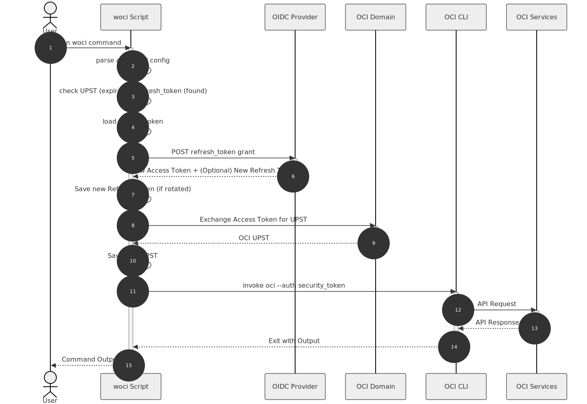

# WOCI Session Manager Quick Start
<!-- License: MIT (see LICENSE file). Copyright (c) 2025 Gordon Trevorrow -->

Wraps the OCI CLI to transparently obtain and refresh an OCI session token (UPST) via:
1. OAuth 2.0 Authorization Code + PKCE (interactive, first use)
2. Refresh Token grant (silent renew of access token)
3. OCI Workload Identity Federation token exchange (RFC 8693 profile with OCI-specific extensions)
4. Optional background auto-refresh to renew the UPST before expiry for long-running commands

## Sequence Diagrams

### Initial Authentication Flow
This sequence diagram illustrates how the session manager obtains an OCI session token when no valid session token or refresh token exists (first-time use or after tokens expire):


### Token Refresh Flow
This diagram shows the silent refresh flow when the UPST is expired but a valid refresh token exists:



## Prerequisites

Before installing the wrapper, ensure you have:

### OCI Workload Identity Federation Configuration [🔗](https://docs.oracle.com/en-us/iaas/Content/Identity/api-getstarted/json_web_token_exchange.htm)
- **Trust relationship configured**: OCI Workload Identity Federation (WIF) must be set up to establish trust between your OIDC Provider (e.g., Okta) and an OCI IAM domain.
- **User exists in the domain**: Your user account must exist in the OCI IAM domain where you configured the WIF trust. 
See [OCI Workload Identity Federation documentation](https://docs.oracle.com/en-us/iaas/Content/Identity/api-getstarted/json_web_token_exchange.htm) for detailed setup steps.

### OIDC Client Registrations:
- **OAuth client registered**: An OAuth 2.0 client  must be registered in your OIDC Provider with:
    - Authorization Code grant type enabled
    - **PKCE** (Proof Key for Code Exchange) enabled/required (S256 challenge method)
    - Refresh Token grant type enabled (offline_access scope)
    - Redirect URI `http://127.0.0.1:8181/callback` (or your chosen port) registered
  
### Runtime Requirements
- Python 3.9+ 
- OCI CLI installed and on PATH (`oci` command available)

## Get the code (GitHub)
Choose one of the following ways to fetch the sources from the GitHub repo:

- Git clone:
```bash
git clone https://github.com/gtrevorrow/OCI-CLI-Tools.git
cd OCI-CLI-Tools
# checkout the main branch
git checkout main
```

- Download the branch as a ZIP (no git required):
```bash
curl -L -o woci.zip \
  "https://codeload.github.com/gtrevorrow/OCI-CLI-Tools/zip/refs/heads/main"
unzip woci.zip
cd OCI-CLI-Tools-*
```

- Download a specific commit (locked snapshot):
```bash
# commit: 08ed2b830551ba34cfdff700f712934e2293dbda (frozen snapshot)
curl -L -o woci-commit.zip \
  "https://codeload.github.com/gtrevorrow/OCI-CLI-Tools/zip/08ed2b830551ba34cfdff700f712934e2293dbda"
 unzip woci-commit.zip
 cd OCI-CLI-Tools-*
```
This URL ends with the commit SHA, so you always download that exact revision regardless of future branch changes.

Expected files (minimal checklist):
- `oci_upst_session_manager.py` (main tool)
- `requirements.txt` (deps)
- `install.sh` (Option 1 installer)
- `woci_manager.ini` (sample manager config)
- `pyproject.toml` (pipx install)
- `QUICKSTART.md`, `LICENSE`

## Install

Prerequisites (again):
- Python 3.9+ 
- OCI CLI installed (`oci` on PATH)

### Option 1: Self-contained installer script (recommended)
Creates an isolated virtualenv under `~/.local/share/oci-upst-manager` and a launcher in `~/.local/bin`.
```bash
chmod +x install.sh
./install.sh
~/.local/bin/oci-upst-session-manager --help
```
Optional convenience alias "woci":
```bash
ln -sf "$HOME/.local/bin/oci-upst-session-manager" "$HOME/.local/bin/woci"
which woci
```
If `~/.local/bin` is not on your PATH (bash):
```bash
echo 'export PATH="$HOME/.local/bin:$PATH"' >> ~/.bash_profile
source ~/.bash_profile
```
Note:
The launcher name is `oci-upst-session-manager`; adding the `woci` alias is for convenience.

### Option 2: Symlink directly to the script (simple, uses system Python)
Install Python dependencies into the interpreter that will run the script:
```bash
python3 -m pip install --user -r requirements.txt
```
Then create a convenient shim:
```bash
chmod +x oci_upst_session_manager.py
ln -sf "$(pwd)/oci_upst_session_manager.py" /usr/local/bin/woci
which woci
woci --help
```

### Option 3: Manual virtualenv (you manage the venv)
```bash
python3 -m venv .woci-venv
source .woci-venv/bin/activate
pip install -r requirements.txt
python oci_upst_session_manager.py --help
# Optional global shim
ln -sf "$(pwd)/oci_upst_session_manager.py" /usr/local/bin/woci
```


## Configuration Files

#### OCI CLI config (standard):  e.g.  `~/.oci/config`

#### WOCI manager config (`woci_manager.ini`)

This file contains the **Identity Provider configuration** required to perform the OAuth 2.0 and token exchange flows. While `~/.oci/config` holds standard OCI settings (region, tenancy), `woci_manager.ini` holds the **OIDC details** (Authorization URL, Token URL, Client IDs) that the OCI CLI does not natively understand.

Default auto-discovery filename: `woci_manager.ini`.

Auto-discovery and precedence rules:
1. Wrapper reads the OCI config file specified via the `--config-file` option (default `~/.oci/config`).
2. Looks for `woci_manager.ini` in the same directory as that OCI config file.
3. If not found there, looks for `~/.oci/woci_manager.ini`.
4. If the environment variable `WOCI_MANAGER_CONFIG` is set, its path is used instead of any auto-discovered file.
5. An explicit `--manager-config` CLI flag overrides both the environment variable and auto-discovery.
Notes:
- If `--manager-config` or `WOCI_MANAGER_CONFIG` is provided but the file cannot be read, the wrapper exits with a configuration error.
- If only an auto-discovered file is present and it cannot be read, the wrapper ignores it and continues without manager-config. **In this state, it can only reuse an existing valid UPST; it will fail if authentication or refresh is required.**
The manager INI supports a `[COMMON]` section for shared values across profiles (e.g., `redirect_port`, `log_level`).
If you do not supply a profile, the wrapper falls back to the OCI-style `DEFAULT` profile name (artifacts land in `~/.oci/sessions/DEFAULT/`) if a corresponding section exists or can be inferred. You pick an explicit profile via OCI passthrough `--profile`. `[COMMON]` only contributes shared values; it never selects the profile.

Section name is chosen using precedence documented in Profile Resolution Semantics. CLI flags override section values; manager config never overrides an explicitly supplied CLI flag.

Sample `woci_manager.ini`:
```ini
[COMMON]
redirect_port = 8181
log_level = INFO
auto_refresh = true
refresh_safety_window = 600

[myprofile]
authz_base_url = https://idcs-tenant.identity.oraclecloud.com/oauth2/v1/authorize
token_url = https://idcs-tenant.identity.oraclecloud.com/oauth2/v1/token
auth_client_id = YOUR_AUTH_CODE_CLIENT_ID
auth_client_secret = YOUR_AUTH_CODE_CLIENT_SECRET
client_id = YOUR_OCI_EXCHANGE_CLIENT_ID
client_secret = YOUR_OCI_EXCHANGE_CLIENT_SECRET
scope = openid offline_access
```

Token exchange endpoint guidance:
- If the Authorization Code/refresh flow runs against the OCI IAM domain that also provides the RFC 8693 exchange, leave `token_exchange_url` unset; the tool reuses `token_url` for both refresh and exchange.
- If you do Authorization Code/refresh at another OIDC provider and then exchange at OCI IAM’s fixed exchange endpoint, set `token_exchange_url` to that OCI IAM endpoint explicitly.

## Profile Resolution Semantics
The effective profile governs both the manager metadata and the session artifacts (and is also forwarded to OCI if you did not set `--profile` in the passthrough args).

Rules:
- The active profile is determined by the `--profile` flag (passed through to OCI).
- If no profile is provided, the wrapper falls back to looking for a `[DEFAULT]` section in the manager INI. If found, it uses that.
- If a profile IS provided (e.g. `--profile prod`), the wrapper looks for a `[prod]` section in the manager INI.
- `[COMMON]` is a special section for **shared configuration**. All other sections automatically inherit values from it (unless they override them). Use it to avoid repeating things like `redirect_port` or `log_level`.
- `[DEFAULT]` is treated as just another named profile section. It is **not** a base for inheritance. It is only selected if you run the tool without specifying a profile (and no other sections match).

Artifacts stored under: `~/.oci/sessions/<profile>/`:
- `token` (UPST)
- `private_key.pem`
- `refresh_token` (optionally encrypted)

OCI config is updated (created if absent) with:
- `key_file`
- `security_token_file`
- `region` (if provided)

Additional notes:
- DEFAULT pseudo-section contributes values only; it is not used as a profile name.
- The effective profile determines the folders: `~/.oci/sessions/<profile>/`.

## Redirect URI & Port
Default redirect URI: `http://127.0.0.1:8181/callback`
Change port with `--redirect-port <port>` (must match a registered redirect URI in your OAuth client).
Make sure you register the exact URI (host, port, path) with your authorization server.

## Required Runtime Values
Must be provided via CLI or manager config: `authz_base_url`, `token_url`, `auth_client_id`, `client_id`, `client_secret`, `scope`.
`client_secret` is mandatory for OCI IAM token exchange.
- `scope` must include `offline_access` (or equivalent for your provider) to obtain a refresh token.

### Why two client registrations?
Most deployments need two distinct OAuth clients:
1. **Authorization/Refresh client (`auth_client_id`, optional `auth_client_secret`)** – lives in your OIDC provider (Okta, Azure AD, IDCS, etc.) and handles the Authorization Code + Refresh Token grants. It issues ID/access tokens and long-lived refresh tokens that represent the human user.
2. **OCI Workload Identity Federation client (`client_id`/`client_secret`)** – lives in the OCI IAM domain that trusts your OIDC provider. It participates in the RFC 8693 token exchange, taking the access token from step 1 and producing an OCI UPST tied to your OCI profile.

## Encryption (Optional)
Provide a passphrase to encrypt the refresh token file:
- `--refresh-token-passphrase-env VAR_NAME` (VAR_NAME must be set in environment)
- `--refresh-token-passphrase-prompt` (interactive prompt)
Algorithm: AES-GCM + PBKDF2 (200k iterations) + random salt/nonce.

Behavior:
- If the stored refresh token file is encrypted and you invoke without a passphrase source, the wrapper errors out and does not proceed.
- Passphrase precedence: prompt (`--refresh-token-passphrase-prompt`) > env (`--refresh-token-passphrase-env`).

## First Run Flow
1. Launch `woci` with an OCI command.
2. If no valid UPST & refresh token: browser opens Authorization Code flow (PKCE).
3. Exchange code -> access + refresh tokens.
4. Exchange access token -> UPST; store artifacts; update OCI config.
5. Forward original OCI command.

Subsequent runs:
- If UPST still valid (>60s remaining) => reuse.
- Else if refresh token exists => refresh + exchange silently.
- Else fallback to interactive flow again.

Optional background auto-refresh (in-process thread):
- Best for long-running wrapper jobs (e.g., CI/CD scripts) where the session must stay valid *during* execution but doesn't need to persist afterwards.
- Enable `--auto-refresh` (or `auto_refresh = true` in the manager INI).
- The refresher uses the refresh token to obtain a new UPST about 10 minutes before expiry.
- `--refresh-safety-window <seconds>` controls how early the refresh happens (default `600`).

Daemon mode (background refresh logic that outlives the CLI process):
- Ideal for keeping sessions fresh for external tools (Terraform, IDEs, generic OCI CLI usage) without running the wrapper every time.
- Run `woci --daemon session authenticate` to mint a UPST and start a background refresh process.
- The daemon PID is stored at `~/.oci/sessions/<profile>/woci_refresh.pid`.
- Manage it with `--daemon-status` and `--stop-daemon`.

## Usage Examples

Interactive cluster token generation:
```bash
woci \
  --profile myprofile \
  --authz-base-url https://idcs-tenant.identity.oraclecloud.com/oauth2/v1/authorize \
  --token-url https://idcs-tenant.identity.oraclecloud.com/oauth2/v1/token \
  --client-id YOUR_CLIENT_ID \
  --client-secret YOUR_CLIENT_SECRET \
  --scope "openid offline_access" \
  ce cluster generate-token --cluster-id OCID
```
(Region may be inferred from OCI config; add `--region us-ashburn-1` if needed.)

Using manager config only (auto-discovered):
```bash
woci ce cluster generate-token --cluster-id OCID --profile myprofile
```

Encrypt refresh token (env var method):
```bash
export WOCI_RT_PASSPHRASE="StrongPassphrase"
woci --refresh-token-passphrase-env WOCI_RT_PASSPHRASE ... <OCI COMMAND>
```

Add token exchange URL if needed:
```bash
woci --token-exchange-url https://login.us-ashburn-1.oraclecloud.com/oauth2/v1/token ...
```

## Kubeconfig Exec Integration
Example user exec block that references the woci-manager.ini config file and profile to generate a cluster token:
```yaml
-  user:
     exec:
       apiVersion: client.authentication.k8s.io/v1beta1
       args:
         - ce
         - cluster
         - generate-token
         - --cluster-id
         - ocid1.cluster.oc1.iad.aaaaaaaat7zsrk4k2rn5y33v2srajzcbspo2t62jxzi73nkzfcsouxxxxx
         - --region
         - us-ashburn-1
         - --auth
         - security_token
         - --profile
         - myProfile
         - --manager-config
-        - /Users/foo/Documents/projects/token-exchange/woci-manager.ini
+        - /Users/foo/Documents/projects/token-exchange/woci_manager.ini
       command: woci
```
First call triggers interactive login; subsequent calls refresh silently.

## Troubleshooting
- Browser not opening: copy logged Auth URL manually; on macOS the script attempts `open` fallback.
- "Missing required options": ensure values present via CLI or config section.
- "Could not determine profile name": provide `--profile` or add a named section.
- Token not refreshing: check presence/permissions of `~/.oci/sessions/<profile>/refresh_token`.
- Encrypted refresh token but no passphrase supplied: provide env var or prompt flag.
- Encrypted refresh token error: supply passphrase again (env or prompt) to unlock.
- Authorization errors: verify redirect URI registration & exact client_id/client_secret.
- Browser fails to open: copy the logged `Auth URL:` manually or run `open <URL>` on macOS.

## Security Notes
- Refresh token is sensitive; prefer encryption at rest.
- Session token lifetime is capped at 60 minutes; the wrapper renews via refresh token before running OCI commands.
- Passphrase derivation uses PBKDF2-HMAC-SHA256 (200k iterations) for a balanced cost.
Additional considerations:
- Avoid committing `woci_manager.ini` if it contains a `client_secret`.
- Tokens are never logged; only the authorization URL is printed.
- Refresh token rotation: Some providers rotate refresh tokens; script saves new one if returned.

## Exit Codes
- 0  Wrapper succeeded and underlying OCI command exited 0
- 2  Argument or configuration error detected by wrapper (missing required values, invalid URLs, unreadable manager config, profile resolution failure)
- 127 'oci' executable not found on PATH
- 1  Internal runtime failure (authorization flow, token exchange, file write) OR unexpected wrapper exception
- Other non-zero codes: If the OCI CLI runs and returns a non-zero exit code (e.g. 3, 4, etc.), that code is passed through unchanged.

Notes:
- Ctrl-C / SIGINT during passthrough execution propagates to the OCI CLI and results in its exit code.

## Unattended / Headless
Use an initial interactive run to create artifacts, then rely on refresh token afterward. For truly headless environments ensure you can manually visit the Auth URL from a workstation and copy the redirected code if necessary.
Add remote workflow:
- Run once interactively (or forward the auth URL to an operator) to capture refresh token.
- Subsequent cron/container invocations reuse and refresh silently.

## Updating
 
To update the tool to the latest version, pull the changes from git and re-run the installer:

```bash
cd OCI-CLI-Tools
git pull origin main
./install.sh
```

**Note**: This assumes you used **Option 1 (install.sh)** originally.
- Running `./install.sh` is **idempotent** and safe to run every time.
- It ensures that any new dependencies in `requirements.txt` are installed and the environment is consistent.
- If you installed manually (Option 2/3), you must manage your own `pip install` updates.


---
For feature requests (OIDC discovery, configurable callback path, non-browser device flow fallback), extend the script where noted in comments.

## Wrapper CLI options and precedence

Wrapper-only flags (not passed through to OCI; all other args are forwarded to the `oci` CLI unchanged):
- `--manager-config <path>`: Path to woci manager INI. If omitted, auto-discovery applies (see Configuration Files).
-  Use `woci_manager.ini` (underscore) if you rely on auto-discovery; other filenames require `--manager-config` or `WOCI_MANAGER_CONFIG`.
- `--authz-base-url <url>`: Full authorization endpoint URL used for Authorization Code flow with PKCE.
- `--token-url <url>`: OAuth2 token endpoint for authz code and refresh grants.
- `--auth-client-id <id>` / `--auth-client-secret <secret>`: OAuth/OIDC client credentials used to perform the Authorization Code + Refresh Token grants against your identity provider.
- `--token-exchange-url <url>`: Optional; if omitted, `--token-url` is reused for exchange.
- `--client-id <id>` / `--client-secret <secret>`: OAuth2 client credentials (client_secret is required for OCI IAM token exchange).
- `--scope <scopes>`: Must include `offline_access` to obtain a refresh token.
- `--redirect-port <port>`: Local callback port (default `8181`); redirect URI is `http://127.0.0.1:<port>/callback`.
- `--refresh-token-passphrase-env <VAR>`: Env var containing passphrase to encrypt/decrypt the refresh token file.
- `--refresh-token-passphrase-prompt`: Prompt for passphrase interactively.
- `--auto-refresh`: Start a background thread that refreshes the UPST before expiry.
- `--refresh-safety-window <seconds>`: How many seconds before expiry the refresh occurs (default `600`).
- `--daemon`: Start a background daemon that refreshes the UPST and exit (implies auto-refresh).
- `--daemon-status`: Show daemon status for the selected profile.
- `--stop-daemon`: Stop the daemon for the selected profile.
- `--log-level <LEVEL>`: `DEBUG|INFO|WARNING|ERROR` (default `INFO`).

## Config sources & precedence (summary)

| Setting type              | Sources (highest precedence first)                                                                                                         |
|---------------------------|--------------------------------------------------------------------------------------------------------------------------------------------|
| Manager config path       | `--manager-config` CLI flag → `WOCI_MANAGER_CONFIG` env var → auto-discovered `woci_manager.ini` → none                                    |
| OCI config path           | `--config-file` CLI flag → default `~/.oci/config`                                                                                         |
| Profile name              | `--profile` (OCI) or inferred from manager config section section if no profile provided |
| Other runtime settings    | CLI flags → manager-config section values (merged over `[COMMON]`) → hardcoded defaults (only for `config_file`)                          |
| Manager-config read error | Fatal if path from CLI or env; ignored if from auto-discovery                                                                             |

This table matches the behavior implemented in `oci_upst_session_manager.py` and should be used as the reference for how configuration is resolved at runtime.

If the selected manager-config section contains a `profile_name` key, it is ignored; use the section name as the profile.
